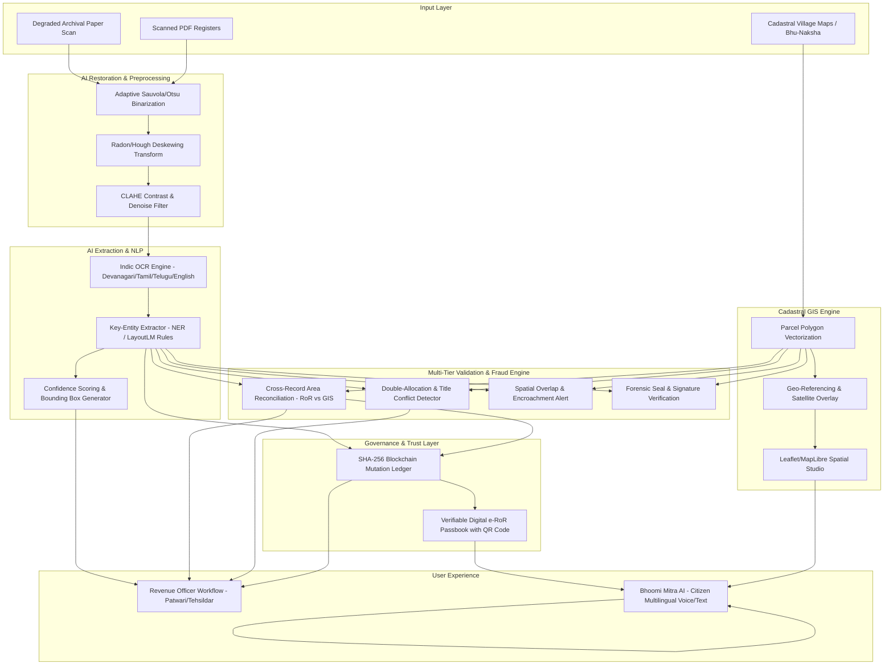

# 🏛️ BhoomiAI: Intelligent Land Record Digitization & Validation System

[](https://opensource.org/licenses/MIT)
[](https://fastapi.tiangolo.com)
[](https://reactjs.org/)
[](https://en.wikipedia.org/wiki/SHA-2)
[](https://dilrmp.gov.in/)

---

## 📌 Executive Summary
Land records across various administrative regions are historically maintained in fragmented, physically degraded paper registers, handwritten legacy formats, and diverse regional scripts (*7/12 Extracts, Khasra, Khatauni, Jamabandi, Pattas, and Cadastral Maps*). Manual entry leads to human errors, boundary disputes, title duplications, and fraudulent double-allocations.

**BhoomiAI** is an enterprise-grade digital governance and AI platform. It combines **Computer Vision for archival document restoration**, **multilingual Indic OCR**, **Cadastral GIS (Bhu-Naksha) vectorization**, **multi-tier anomaly/fraud auditing**, and **cryptographic Blockchain mutation tracking** with verifiable QR-coded digital Records of Rights (e-RoR).

---

## 🏗️ System Architecture



---

## 🚀 Key Modules & Capabilities

| Module | Core Features & Technical Implementation |
| :--- | :--- |
| **1. Archival Restoration Studio** | Adaptive Sauvola binarization, Hough deskewing angle detection, median noise removal, and an interactive **Before/After split comparison slider**. |
| **2. Indic Multilingual OCR & KIE** | Deep key-information extraction for **7/12 (Maharashtra/Gujarat)**, **Khasra-Khatauni (UP/MP)**, **Patta/Chitta (Tamil Nadu)**, and **Jamabandi (Punjab)**. Parses Survey No, Khata No, Landowners with Aadhaar hash, multi-unit area conversions (Ha, Acre, Bigha, Guntha, Sq.m), Soil classification, Tax/Lagan, and Mortgages with visual bounding boxes. |
| **3. Cadastral GIS (Bhu-Naksha) Explorer** | Vectorized land parcel polygons overlaid on high-resolution satellite imagery. Features plot attribute inspector, dispute heatmaps, sub-division (Hissa) split/merge simulator, and GeoJSON export. |
| **4. Multi-Tier AI Fraud & Anomaly Center** | Automated checks: Area discrepancy (RoR vs GIS polygon area), double-allocation alerts, road buffer encroachments, and uncertified mutation gap detection. |
| **5. Blockchain Mutation Ledger** | Immutable SHA-256 Merkle chain recording deed transfers and inheritance splits. Includes **Tamper Simulation Mode** to demonstrate cryptographic chain breakage upon unauthorized edits. |
| **6. Verifiable Digital e-RoR Passbook** | Downloadable official land certificate with embedded dynamic QR code verifying SHA-256 seal. |
| **7. Bhoomi Mitra AI Citizen Assistant** | Conversational AI assistant supporting Hindi, English, Marathi, Tamil, Gujarati, and Telugu with voice synthesis simulation. |

---

## 📂 Project Repository Structure

```
├── backend/                       # Python FastAPI Backend & AI Services
│   ├── main.py                    # REST API Entrypoint & CORS handlers
│   ├── requirements.txt           # Python dependencies (FastAPI, Pillow, NumPy)
│   └── services/
│       ├── restoration.py         # Sauvola binarization, deskewing, dewarping
│       ├── ocr_engine.py          # Indic OCR & LayoutLM rule-based extraction
│       ├── cadastral_gis.py       # GeoJSON polygon processing & spatial metrics
│       ├── validation.py          # Multi-tier anomaly and fraud audit rules
│       └── blockchain.py          # Cryptographic SHA-256 block ledger
│
├── frontend/                      # Modern React 18 + Vite SPA Web Portal
│   ├── src/
│   │   ├── components/            # UI components (Restoration, OCR, GIS, Blockchain, e-RoR)
│   │   ├── data/                  # Pre-loaded realistic Indic land records & GeoJSON
│   │   ├── utils/                 # Multilingual i18n translations & API helpers
│   │   └── index.css              # Glassmorphism & GovTech design system tokens
│   └── package.json
│
├── ocr_mvp/                       # ⚡ Lightweight Standalone Single-Folder OCR MVP
│   ├── app.py                     # Self-contained lightweight Python web app
│   ├── run_ocr_mvp.bat            # 1-Click launcher
│   └── requirements.txt
│
├── start_platform.bat             # 1-Click launcher for full-stack platform
├── start_platform.ps1             # PowerShell 1-click launcher
└── README.md                      # Project documentation
```

---

## ⚡ Quickstart Guide

### Option A: Run Full-Stack Platform
Double-click [`start_platform.bat`](file:///c:/Users/user/Desktop/sih/start_platform.bat) or run:

```bash
# Terminal 1: Backend API
cd backend
pip install -r requirements.txt
python -m uvicorn main:app --port 8000 --host 127.0.0.1 --reload

# Terminal 2: Frontend Web Portal
cd frontend
npm install
npm run dev
```
Open **`http://localhost:5173/`** in your browser.

---

### Option B: Run Lightweight Standalone OCR MVP
Double-click [`ocr_mvp/run_ocr_mvp.bat`](file:///c:/Users/user/Desktop/sih/ocr_mvp/run_ocr_mvp.bat) or run:

```bash
cd ocr_mvp
python app.py
```
Open **`http://localhost:5000/`** in your browser.

---

## 🔒 Security & Standards Compliance
- **Digital India Land Records Modernization Programme (DILRMP)** standards.
- **SHA-256 Cryptographic Block Ledger** for immutable audit trails.
- **Role-Based Access Control (RBAC)** separating Revenue Officer workflows (Patwari/Tehsildar) from Citizen self-service.
- **W3C Verifiable Credentials** with QR code payload hashing.

---

## 📄 License
This project is licensed under the MIT License.
